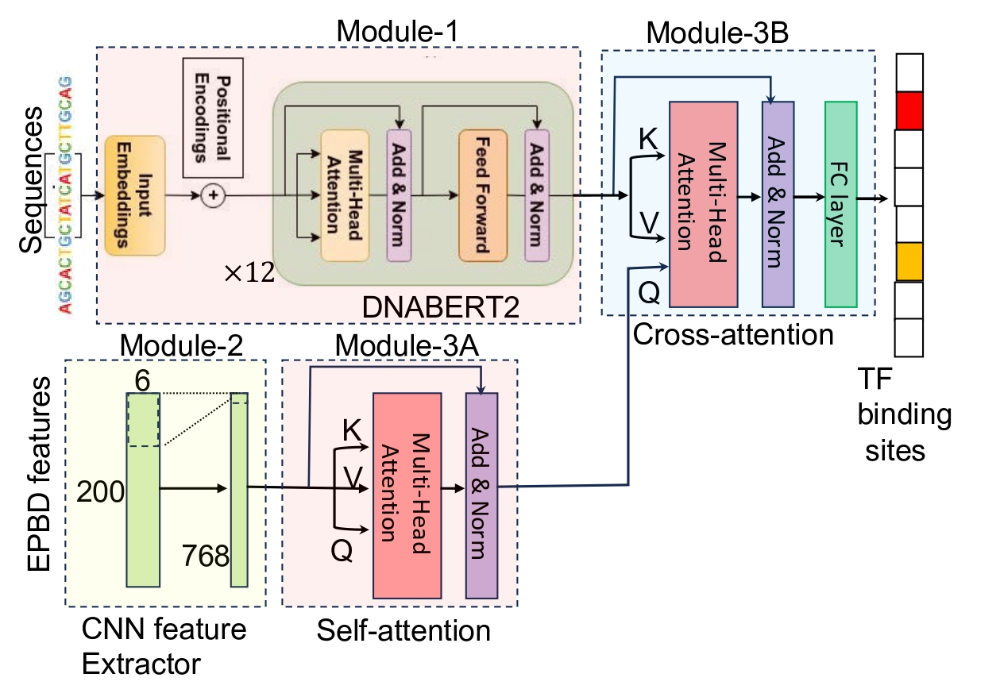

# Welcome to EPBD-BERT's Documentation!

This repository corresponds to the article titled **"Advancing Transcription Factor Binding Site Prediction Using DNA Breathing Dynamics and Sequence Transformers via Cross Attention"**.

[](https://doi.org/10.5281/zenodo.11130474)
(https://www.biorxiv.org/content/10.1101/2024.01.16.575935v2)


*Figure 1: Overview of the proposed EPBDxBERT framework*

Understanding the impact of genomic variants on transcription factor binding and gene regulation remains a key area of
research, with implications for unraveling the complex mechanisms underlying various functional effects. This software
framework delves into the role of DNA's biophysical properties, including thermodynamic stability, shape, and flexibility in
transcription factor (TF) binding. In this library, we have developed a multi-modal deep learning model integrating these
properties with DNA sequence data. Trained on ChIP-Seq (chromatin immunoprecipitation sequencing) data in-vivo
involving 690 TF-DNA binding events in human genome, our model significantly improves prediction performance in over
660 binding events, with up to 9.6% increase in AUROC metric compared to the baseline model when using no DNA
biophysical properties explicitly. Further, we expanded our analysis to in-vitro high-throughput Systematic Evolution
of Ligands by Exponential enrichment (SELEX) dataset, comparing our model with
established frameworks. The inclusion of EPBD features consistently improved TF binding predictions across different cell
lines in these datasets. Notably, for complex ChIP-Seq datasets, integrating DNABERT2 with a cross-attention mechanism
provided greater predictive capabilities and insights into the mechanisms of disease-related non-coding variants found in
genome-wide association studies. This work highlights the importance of DNA biophysical characteristics in TF binding
and the effectiveness of multi-modal deep learning models in gene regulation studies

## Resources

- [Paper](https://www.biorxiv.org/content/10.1101/2024.01.16.575935v2.abstract)
- [Code](https://github.com/lanl/EPBD-BERT)
- [Documentation](https://lanl.github.io/EPBD-BERT/)
- [Analysis Notebooks](https://github.com/lanl/EPBD-BERT/tree/main/analysis)

## Installation
```bash
# Installation of virtural environment
git clone https://github.com/lanl/EPBD-BERT.git
cd EPBD-BERT
conda create -c conda-forge -p .venvs/epbd_bert_condavenv_test1 python=3.11 -y
conda activate .venvs/epbd_bert_condavenv_test1
python setup.py install

conda install -c conda-forge scikit-learn scipy -y
pip uninstall triton # We did not utilize triton for underlying hardware dependency

# To deactivate and remove the venv
conda deactivate
conda remove --name epbd_bert_condavenv_test1 --all -y
conda remove -p .venvs/epbd_bert_condavenv_test1 --all -y

```
<!--- 
conda create -c conda-forge -p .venvs/epbd_bert_condavenv_test1 python=3.11 -y
conda activate .venvs/epbd_bert_condavenv_test1

or

conda create -c conda-forge --name epbd_bert_condavenv_test1 python=3.11 -y
conda activate epbd_bert_condavenv_test1

# The other libraries to analyze the DNA breathing dynamics can be installed using the following command:
conda install -c conda-forge scikit-learn scipy pandas matplotlib seaborn jupyterlab -y
--->


## Data Preprocessing Steps
The 'data_preprocessing' directory holds all the data generation steps and divided into modules for data generation and bug tracking. We utilized '[bedtools](https://bedtools.readthedocs.io/en/latest/)' software for genome operation. Follow the [bedtools installation guide](https://bedtools.readthedocs.io/en/latest/content/installation.html). We also provide a bare minimum script that downloads the pre-compiled binary of the software into the *bedtools* directory:

```bash
bash setup_bedtools.sh
export PATH=$PATH:$(pwd)/bedtools
```

| Step  | Scripts |
| :--- | :--- |
| Download human genome assembly (GRCh37/hg19) and [uniform TFBS](https://genome.ucsc.edu/cgi-bin/hgTrackUi?hgsid=2215774794_SHfvFO0XVRMcn6xaqOTugAa1Faf1&c=chr1&g=wgEncodeAwgTfbsUniform)  | ```0_download_data.py```  |
| Preprocess TFBS narrowpeak files and human genome | ```1_preprocess_narrowPeaks_and_humanGenome.sh``` |
| Overlapping computation for label association | ```2.1_compute_overlappings_job.sh```<br /> ```2.2_compute_overlappings.sh```<br /> ```3_postprocess.sh``` |
| Label association | ```5.1_extract_bins_containingOtherThanACGT.ipynb```<br /> ```5.2_compute_peaks_with_labels_clean.sh```|
| Data preprocessing for DNA breathing dynamics generation and DNABERT2 | ```6.1_create_data_for_pydnaepbd.ipynb```<br />  ```6.2_create_data_for_dnabert2.ipynb``` |
| Train/validation/test split| ```7_create_train_val_test_set.ipynb``` |
| Associating numeric values for each label | ```8_create_labels_dict.ipynb``` |
| Further processing on negative regions | ```9.1_generic_neg_regions.sh```<br /> ```9.2_neg_regions_otherThanACGT.ipynb```<br /> ```9.3_clean_generic_neg_regions.sh```<br /> ```9.4_clean_generic_neg_seqs.ipynb``` |


## Preprocessed dataset loading
Preprocessed dataset can be downloaded from here (will be provided).

| Dataset Module  | Usage |
| :--- | :--- |
| ```epbd_bert.datasets.sequence_dataset```  | Loads sequence only dataset  |
| ```epbd_bert.datasets.sequence_epbd_dataset``` | Loads sequence and EPBD (flat) features |
| ```epbd_bert.datasets.sequence_epbd_multimodal_dataset``` | Loads sequence and EPBD (matrix) features |

Note: There are some other dataset modules. Each module provides example running instructions at the bottom.


## Training and testing the developed models


| Model Module | Usage |
| :--- | :--- |
| DNABERT2-finetuned | |
| ```epbd_bert.dnabert2_classifier.train_lightning``` | Train DNABERT2 using train/validation split |
| ```epbd_bert.dnabert2_classifier.test``` | Test finetuned DNABERT2 on test split |
| VanillaEPBD-DNABERT2-coordflip | |
| ```epbd_bert.dnabert2_epbd.train_lightning``` | Train VanillaEPBD-DNABERT2 using train/validation split |
| ```epbd_bert.dnabert2_epbd.test``` | Test VanillaEPBD-DNABERT2 on test split |
| EPBDxDNABERT-2 | |
| ```epbd_bert.dnabert2_epbd_crossattn.train_lightning``` | Train EPBDxDNABERT-2 using train/validation split |
| ```epbd_bert.dnabert2_epbd_crossattn.test``` | Test EPBDxDNABERT-2 on test split  |

Note: Details of each model with other ablation study can be found in the [Paper](https://www.biorxiv.org/content/10.1101/2024.01.16.575935v2.abstract). To run train/test: ```python -m epbd_bert.dnabert2_classifier.test```.


## Authors

* [Anowarul Kabir] (mailto:akabir4@gmu.edu)- Computer Sciece, George Mason University
* [Manish Bhattarai] (mailto:ceodspspectrum@lanl.gov)- Theoretical Division, Los Alamos National Laboratory
* [Kim Rasmussen] (mailto:kor@lanl.gov)- Theoretical Division, Los Alamos National Laboratory
* [Amarda Shehu] (mailto:ashehu@gmu.edu)- Computer Sciece, George Mason University
* [Anny Usheva] (mailto:Anny\_Usheva@brown.edu>)-Surgery, Rhode Island Hospital and Brown University
* [Alan Bishop] (mailto:arb@lanl.gov)- Theoretical Division, Los Alamos National Laboratory
* [Boian S. Alexandrov] (mailto:boian@lanl.gov)- Theoretical Division, Los Alamos National Laboratory

## How to cite EPBD-BERT?
```latex
@article{kabir2024advancing,
  title={Advancing Transcription Factor Binding Site Prediction Using DNA Breathing Dynamics and Sequence Transformers via Cross Attention},
  author={Kabir, Anowarul and Bhattarai, Manish and Rasmussen, Kim {\O} and Shehu, Amarda and Bishop, Alan R and Alexandrov, Boian and Usheva, Anny},
  journal={bioRxiv},
  pages={2024--01},
  year={2024},
  publisher={Cold Spring Harbor Laboratory}
}
```

## Acknowledgements

Los Alamos National Lab (LANL), T-1

## Copyright notice

© 2024. Triad National Security, LLC. All rights reserved.
This program was produced under U.S. Government contract 89233218CNA000001 for Los Alamos National Laboratory (LANL), which is operated by Triad National Security, LLC for the U.S. Department of Energy/National Nuclear Security Administration. All rights in the program are reserved by Triad National Security, LLC, and the U.S. Department of Energy/National Nuclear Security Administration. The Government is granted for itself and others acting on its behalf a nonexclusive, paid-up, irrevocable worldwide license in this material to reproduce, prepare. derivative works, distribute copies to the public, perform publicly and display publicly, and to permit others to do so.

LANL O#4717

## License

This program is Open-Source under the BSD-3 License.
 
 * Redistribution and use in source and binary forms, with or without modification, are permitted provided that the following conditions are met:
 
* Redistributions of source code must retain the above copyright notice, this list of conditions and the following disclaimer.
 
* Redistributions in binary form must reproduce the above copyright notice, this list of conditions and the following disclaimer in the documentation and/or other materials provided with the distribution.
 
Neither the name of the copyright holder nor the names of its contributors may be used to endorse or promote products derived from this software without specific prior written permission.

THIS SOFTWARE IS PROVIDED BY THE COPYRIGHT HOLDERS AND CONTRIBUTORS "AS IS" AND ANY EXPRESS OR IMPLIED WARRANTIES, INCLUDING, BUT NOT LIMITED TO, THE IMPLIED WARRANTIES OF MERCHANTABILITY AND FITNESS FOR A PARTICULAR PURPOSE ARE DISCLAIMED. IN NO EVENT SHALL THE COPYRIGHT HOLDER OR CONTRIBUTORS BE LIABLE FOR ANY DIRECT, INDIRECT, INCIDENTAL, SPECIAL, EXEMPLARY, OR CONSEQUENTIAL DAMAGES (INCLUDING, BUT NOT LIMITED TO, PROCUREMENT OF SUBSTITUTE GOODS OR SERVICES; LOSS OF USE, DATA, OR PROFITS; OR BUSINESS INTERRUPTION) HOWEVER CAUSED AND ON ANY THEORY OF LIABILITY, WHETHER IN CONTRACT, STRICT LIABILITY, OR TORT (INCLUDING NEGLIGENCE OR OTHERWISE) ARISING IN ANY WAY OUT OF THE USE OF THIS SOFTWARE, EVEN IF ADVISED OF THE POSSIBILITY OF SUCH DAMAGE.

